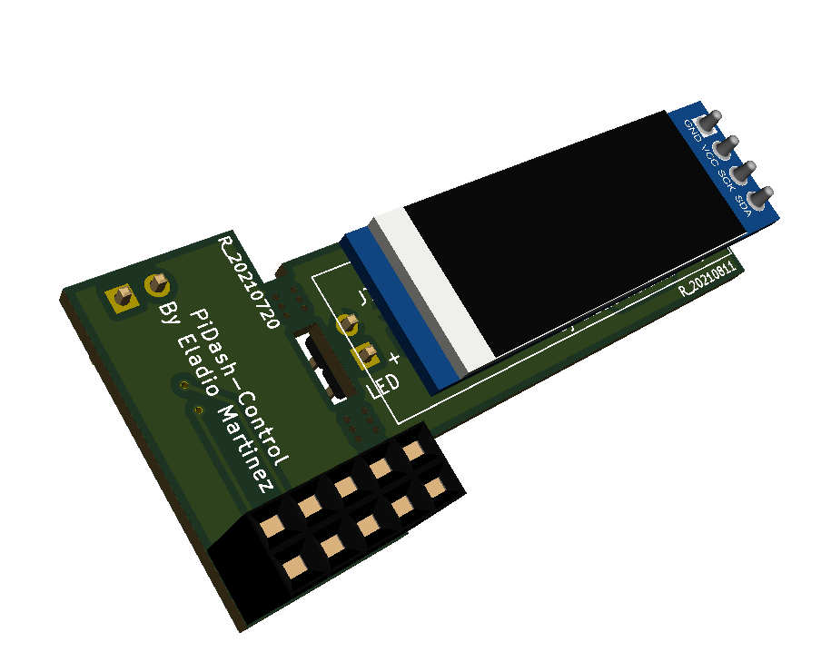
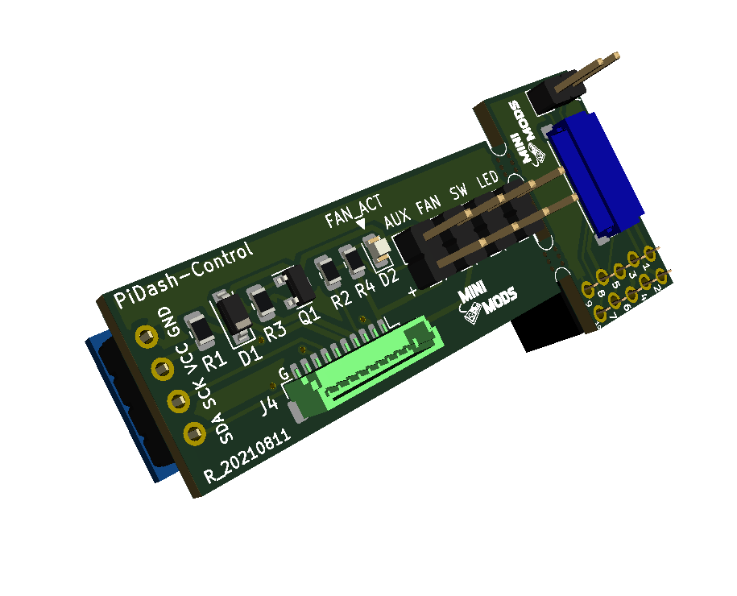

# PiDash-Control
This is a system info display with PWM fan control and a one-button interface for soft-shutdown and reboot of the Raspberry Pi.

License
-------
<div align="center"><a rel="license" href="https://creativecommons.org/licenses/by-nc-sa/4.0/"></a><br /></div>

This project is licensed under the Attribution-NonCommercial-ShareAlike CC BY-NC-SA 4.0 license. The full legal text of the license may be found in the LICENSE.md file in this repository. For more information about this license, please visit 
the Creative Commons Foundation (https://creativecommons.org/licenses/by-nc-sa/4.0/).

Features
--------
* Small footprint

* Easy Temperature Control

* PWM fan control

* I2C 0.91 inch OLED Display

* Compatible with 5V Fans

* One-button interface for soft-shutdown and reboot

* One-line script installation

----------
* PiDash-Control Top View


* PiDash-Control Bottom View

----------

Hardware Installation
---------------------


Software Installation
---------------------

**NOTE**: This assumes that you have already connected the jumper wires to the correct PINS and ports;
If you haven't, see the [Hardware Installation](#hardware-installation) section.

This instructions are a *step-by-step guide* to install necessary software for the **PiDash-Control**.
You can setup this via SSH or using the command line interface.

----------

1. Run ```sudo raspi-config``` and follow the prompts to install i2c support for the ARM core and linux kernel.
2. Go to Interfacing Options > I2C > Enable
3. On the terminal, type the one-line command below (Case Sensitive):

```bash
wget -O - "https://raw.githubusercontent.com/mafe72/PiDash-Control/master/install.sh" | sudo bash
```

The script will automatically install pertinent files and configure your Raspberry Pi to enable **PiDash-Control.**
Installation will automatically reboot once all processes is completed.

After rebooting, your **PiDash-Control** is now fully functional.

Software Uninstall
---------------------

This instructions are a *step-by-step guide* to uninstall necessary software for your **PiDash-Control**.
You can setup this via SSH or using the command line interface.

----------

Open your terminal and type the one-line installation command below:
```bash
wget -O - "https://raw.githubusercontent.com/mafe72/PiDash-Control/master/uninstall.sh" | sudo bash
```

The script will automatically uninstall all configuration files from your Raspberry Pi to disable the **PiDash-Control.**
The uninstall script will automatically reboot once all processes are completed.

After rebooting, your **PiDash-Control** will be fully deactivated.

----------

Basic Hardware Usage
--------------------

## Info Button Basic Usage:

* Button Single Press
			
		Display show system information, IP, CPU load and current temperature and system uptime
		
* Button Hold 5 seconds
		
		System will reboot
		
* Button hold 10 seconds
		
		System wil soft-shutdown


## Fan Control

* FAN ON
			
		Fan will turn ON when temperature exceeded 55C
		
* FAN OFF
		
		Fan will turn OFF when temperature under 40C

----------

Basic Software Usage
--------------------


Basic Maintenance
-----------------

